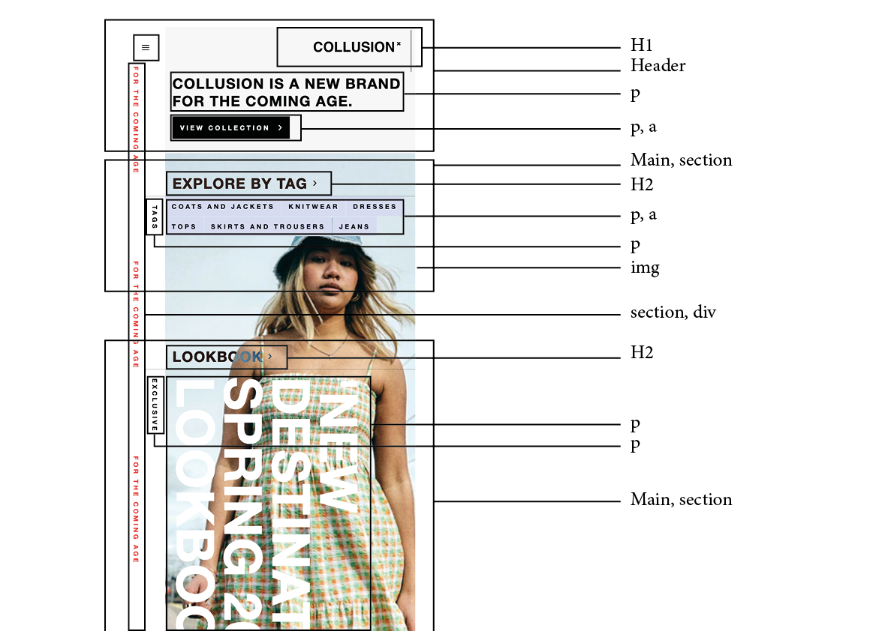
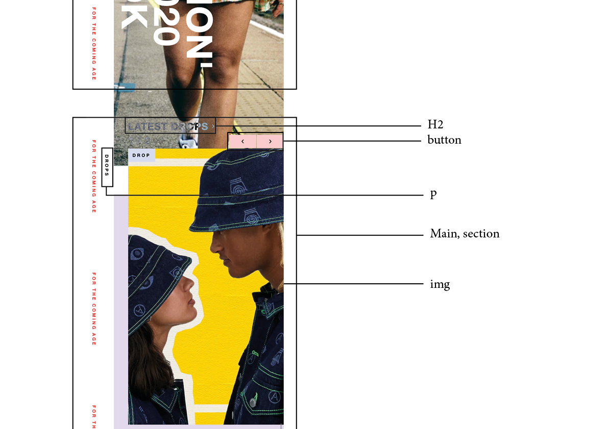
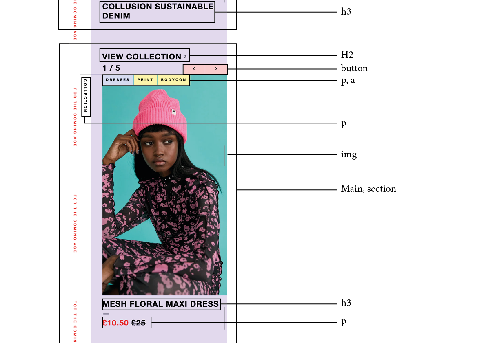
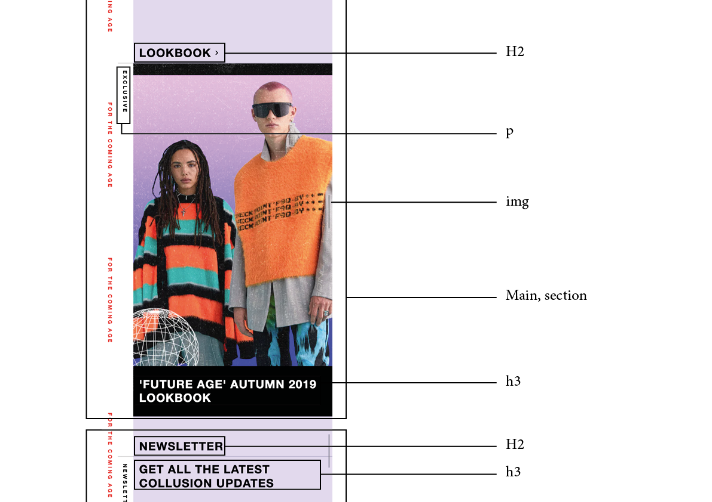
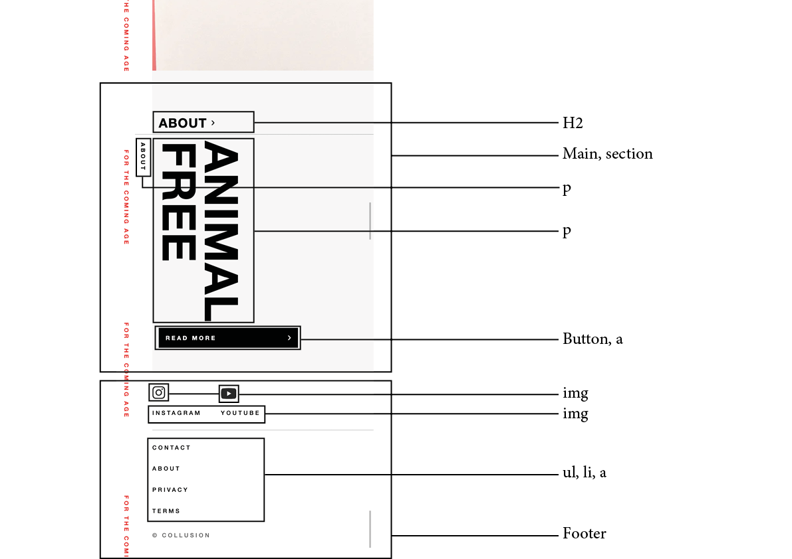
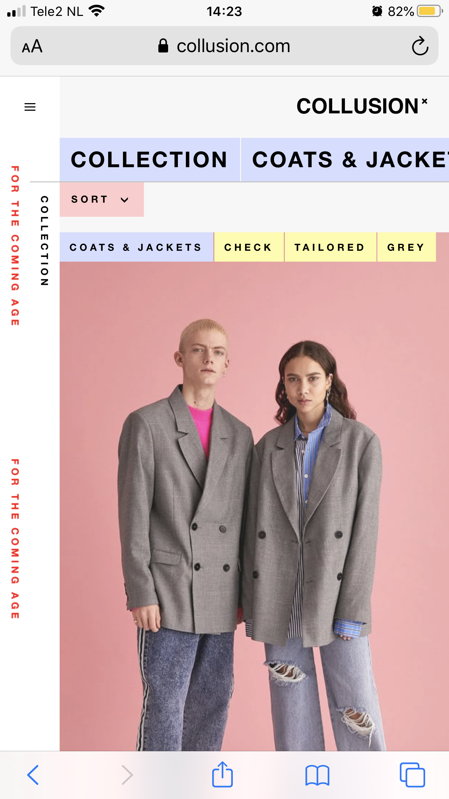

# Procesverslag
**Auteur:** -Emma Kengen-

Markdown cheat cheet: [Hulp bij het schrijven van Markdown](https://github.com/adam-p/markdown-here/wiki/Markdown-Cheatsheet). Nb. de standaardstructuur en de spartaanse opmaak zijn helemaal prima. Het gaat om de inhoud van je procesverslag. Besteedt de tijd voor pracht en praal aan je website.

## Bronnenlijst
1. https://chenhuijing.com/blog/flexbox-and-absolute-positioning/#%F0%9F%8F%80
2. https://www.collusion.com/
3. https://developer.mozilla.org/en-US/docs/Web/CSS/display
4. https://css-tricks.com/snippets/css/a-guide-to-flexbox/

## Eindgesprek (week 7/8)

-dit ging goed & dit was lastig-

**Screenshot(s):**

-screenshot(s) van je eindresultaat-

## Voortgang 3 (week 6)

-same as voortgang 1-

## Voortgang 2 (week 5)

-same as voortgang 1-

## Voortgang 1 (week 3)

### Stand van zaken

Wat ging goed?
- Het is al weer een hele tijd geleden dat we een website hebben moeten coderen, maar gelukkig zat ik er snel weer in
- Het html-en 

Wat vond ik lastig?
- Het positioneren van de verschillende elementen
- Het werken met verschillende lagen

Waar ik nog niet aan toe ben gekomen?
- het werken aan de tweede pagina
- het implementen van javascript
- het toevoegen van annimaties

**Screenshot(s):**

### Agenda voor meeting

-samen met je groepje opstellen-

| Adriaan                                             | Dionne                             | Emma                               | Giovanni       |
| ---                                                 | ---                                | ---                                | ---               |
| In hoever moet je je javascript kunnen uitleggen    | Semantisch correct                 | Semantisch correct                 | Checken of ik goed op weg bent |
|                                                     | beste manier om html te selecteren | Checken of goed op weg ben         |                       |
| ...                                                 | ...                                | ...                                | ...                  |

### Verslag van meeting

-na afloop snel uitkomsten vastleggen-

## Breakdownschets (week 1)

-uitwerken voor de 1e werkgroep - eind van de eerste week-

## Intake (week 1)
-uitwerken voor de kick-off werkgroep - begin van de eerste week-

**Je startniveau:** -rood-

**Je focus:** -surface plane-

**Je opdracht:** -https://www.collusion.com/-

**Screenshot(s) van de eerste pagina (small screen):**

**Screenshot(s) van de tweede pagina (small screen):**

