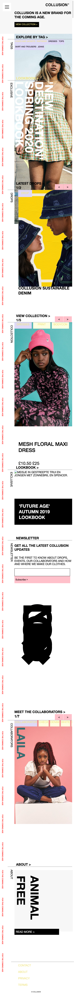
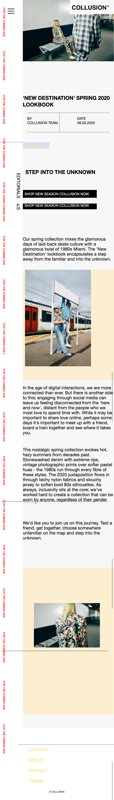
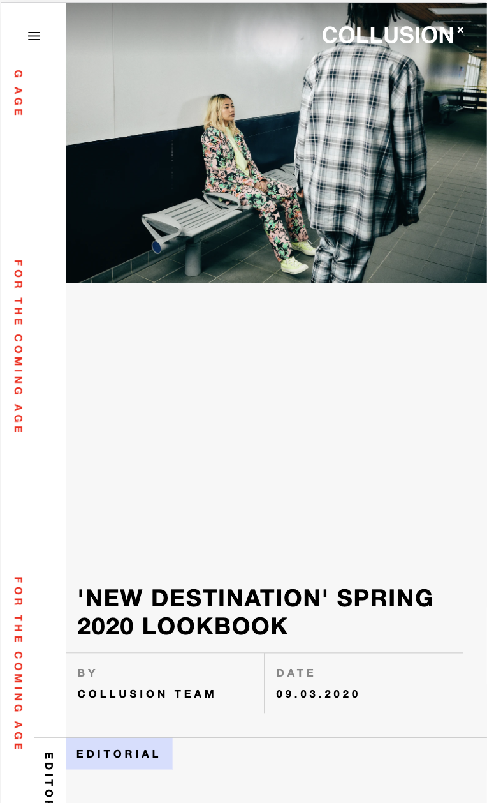

# Procesverslag
**Auteur:** -Emma Kengen-

Markdown cheat cheet: [Hulp bij het schrijven van Markdown](https://github.com/adam-p/markdown-here/wiki/Markdown-Cheatsheet). Nb. de standaardstructuur en de spartaanse opmaak zijn helemaal prima. Het gaat om de inhoud van je procesverslag. Besteedt de tijd voor pracht en praal aan je website.

## Bronnenlijst
1. https://chenhuijing.com/blog/flexbox-and-absolute-positioning/#%F0%9F%8F%80
2. https://www.collusion.com/
3. https://developer.mozilla.org/en-US/docs/Web/CSS/display
4. https://css-tricks.com/snippets/css/a-guide-to-flexbox/
5. https://css-tricks.com/can-get-pretty-far-making-slider-just-html-css/
6. https://css-tricks.com/snippets/css/complete-guide-grid/
7. https://codepen.io/shooft/pen/jOMOroZ
8. https://dev.to/ljcdev/easy-hamburger-menu-with-js-2do0

## Eindgesprek (week 7/8)
Wat ging goed?
- als ik eenmaal bezig was, dan lukte het ook om alles op de juiste plek te krijgen
- werken met keyframe ging soepeler dan verwacht

Wat vond ik lastig?
- Zorgen dat ik niet codes dubbel schrijf. Ik ben 3x opnieuw begonnen om ervoor te zorgen dat ik zo min mogelijk code gebruik. Dus i.p.v. position, ben ik gaan werken met grid, maar uiteindelijk heb ik volgensmij meer code gebruikt dan bij eerdere versies. Dus opnieuw beginnen is niet altijd het antwoord ;)
- Het werken met javascript. Ik zorgt meestal inspiratie op online, zag allerlei toffe micro-interacties met confetti en icons, maar meestal liep ik al vast bij de eerste paar stappen.
- Ik was heel gefocust op het exact namaken van de website, dat ik de surface plane telkens uitstelde, waardoor ik aan het einde niet veel tijd overhad om uitgebreid bezig te zijn met javascript.

Waar ik nog niet aan toe ben gekomen?
- Ik heb uiteindelijk van alles een beetje gedaan, keyframes, javascript, toegankelijkheid en grid. Dingen waarmee ik voorheen nooit echt mee heb gewerkt. Enige waar ik niet meer echt aan toe ben gekomen is het responsive maken van de website en dus werken met media queries. Dit is iets waar ik me in de toekomst nog wel mee bezig wil houden.

**Screenshot(s):**

## Voortgang 3 (week 6)
## Stand van zaken
Wat ging goed?
- annimatie maken

Wat vond ik lastig?
- het goed krijgen van de afbeeldingen/background-colors in een grid
- Img overlapt de tekst, hoe krijg kan ik dat veranderen.

Waar ik nog niet aan toe ben gekomen?
- Verdiepen in micro-interacties/surface plane. Eventueel kijken naar het maken van een responsive website.

### Verslag van meeting

- Background img & background-color kunnen niet op een grid worden gezet, dus je kan ze op de content zetten.
- Je bent erg gefocust op het namaken van de website, probeer nu ook te focussen op toegankelijkheid en micro-interacties.
- Z-index kan ook gebruikt worden zonder position:relative/absolute, dus hiermee kan je afbeeldingen naar de achtergrond zetten en content naar de voorgrond.

**Screenshot(s):**

## Voortgang 2 (week 5)
## Stand van zaken

Wat ging goed?
- Werken met grid, ook al heb ik er nooit mee gewerkt.
- Het niet gebruiken van classes waar mogelijk.

Wat vond ik lastig?
- Het implementeren van een annimatie
- Het werken met verschillende lagen

Waar ik nog niet aan toe ben gekomen?
- Ik ben opnieuw begonnen, derde versie, omdat mijn code nogal onoverzichtelijk werd, hierdoor heb ik nog niet veel tijd besteed aan het implementeren van Javascript/Annimaties

### Verslag van meeting

- Annimatie semantisch correct maken, nu nog veel regels, misschien kan je het samenvoegen door bijvoorbeeld een animation delay.
- Annimatie tekst links v.h. scherm met javascript
- Background img & background-color op grid zetten

**Screenshot(s):**

## Voortgang 1 (week 3)

### Stand van zaken

Wat ging goed?
- Het is al weer een hele tijd geleden dat we een website hebben moeten coderen, maar gelukkig zat ik er snel weer in
- Het html-en 

Wat vond ik lastig?
- Het positioneren van de verschillende elementen
- Het werken met verschillende lagen

Waar ik nog niet aan toe ben gekomen?
- het werken aan de tweede pagina
- het implementen van javascript
- het toevoegen van annimaties

### Agenda voor meeting

-samen met je groepje opstellen-

| Adriaan                                             | Dionne                             | Emma                               | Giovanni       |
| ---                                                 | ---                                | ---                                | ---               |
| In hoever moet je je javascript kunnen uitleggen    | Semantisch correct                 | Semantisch correct                 | Checken of ik goed op weg bent |
|                                                     | beste manier om html te selecteren | Checken of goed op weg ben         |                       |
| ...                                                 | ...                                | ...                                | ...                  |

### Verslag van meeting

Dingen die nog beter kunnen:
- classes verwijderen op de sections, nth-of-type gebruiken
- h1-h4 nog even checken, uitleg van een product is dat een h3?
- alle classes op de flexbox in ul li lijstjes zetten
- % en em mogen beide gebruikt worden (geen px)

**Screenshot(s):**

## Breakdownschets (week 1)

-uitwerken voor de 1e werkgroep - eind van de eerste week-

## Intake (week 1)
-uitwerken voor de kick-off werkgroep - begin van de eerste week-

**Je startniveau:** -rood-

**Je focus:** -surface plane-

**Je opdracht:** -https://www.collusion.com/-

**Screenshot(s) van de eerste pagina (small screen):**

**Screenshot(s) van de tweede pagina (small screen):**

